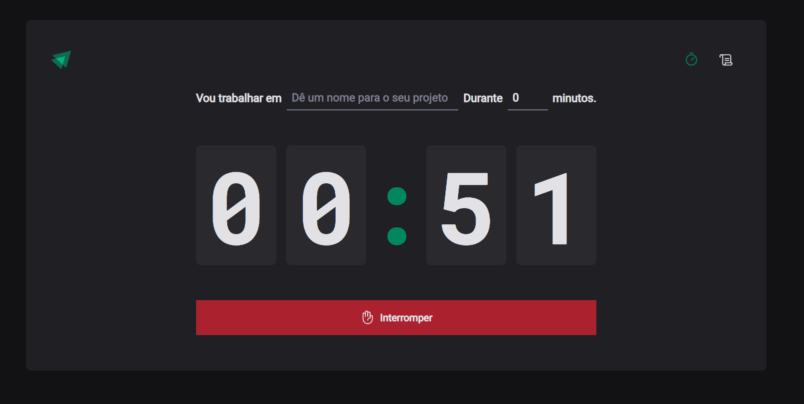
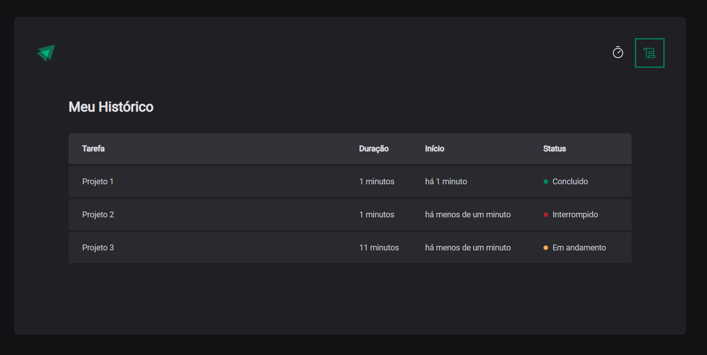

<h1 align="center"> Timer </h1>

  Projeto realizado durante o módulo II do ignite da disciplina de ReactJS.

  <a href="#-tecnologias">Tecnologias</a>&nbsp;&nbsp;&nbsp;|&nbsp;&nbsp;&nbsp;
  <a href="#-projeto">Projeto</a>&nbsp;&nbsp;&nbsp;

 

  

  

## 🚀 Tecnologias

Esse projeto foi desenvolvido com as seguintes tecnologias:

- React com Typescript
- Styled Componentes
- React Hook Form
- Context
- Figma

## 💻 Projeto

O projeto Timer é uma ferramenta desenvolvida para cronometrar o tempo dedicado a diferentes tarefas. Ele pode ser utilizado como um método Pomodoro, facilitando a gestão do tempo e a produtividade do usuário. Além disso, o Timer oferece funcionalidades como o registro histórico de tarefas, permitindo que os usuários acompanhem o progresso e identifiquem se as atividades estão concluídas, interrompidas ou ainda em andamento.